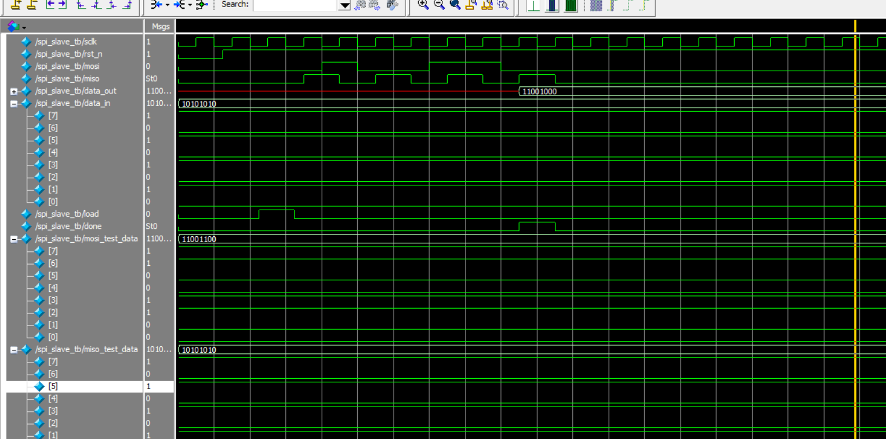

# 🧠 Verilog SPI Slave

This project implements an **SPI Slave module (MSB-first)** using Verilog.  
It includes a complete testbench and waveform validation to verify correct data transmission and timing behavior.

---

## 📌 Features

- ✅ MSB-first SPI data reception
- ✅ Shift register-based transmission and reception
- ✅ `load` control signal to preload `data_in`
- ✅ `done` flag indicates transfer complete (8-bit)
- ✅ Compatible with SPI Mode 0 (CPOL=0, CPHA=0)
- ✅ Self-contained testbench with waveform output

---

## 🧩 RTL Structure

Below is the high-level architecture of the SPI Slave module:

> 

---

## 🧪 Simulation Result

The waveform below shows successful transmission of `11001100` from MOSI and reception of `10101010` through MISO.  
The `done` flag goes high after 8 bits of data are shifted.

> 

---

## 📂 File Overview

| File               | Description                        |
|--------------------|------------------------------------|
| `spi_slave.v`       | RTL code for SPI Slave module      |
| `spi_slave_tb.v`    | Testbench to verify functionality  |
| `RTL_spi_slaver.png`| RTL block diagram image            |
| `wave_spi_slave_tb.png` | Waveform result from simulation |

---

## ▶️ How to Simulate

1. Compile `spi_slave.v` and `spi_slave_tb.v` in your Verilog simulator (e.g. ModelSim, Questa, or iverilog).
2. Run simulation and observe waveform.
3. You should see `data_out` match the input `mosi_test_data` and `done` go high after 8 clocks.
